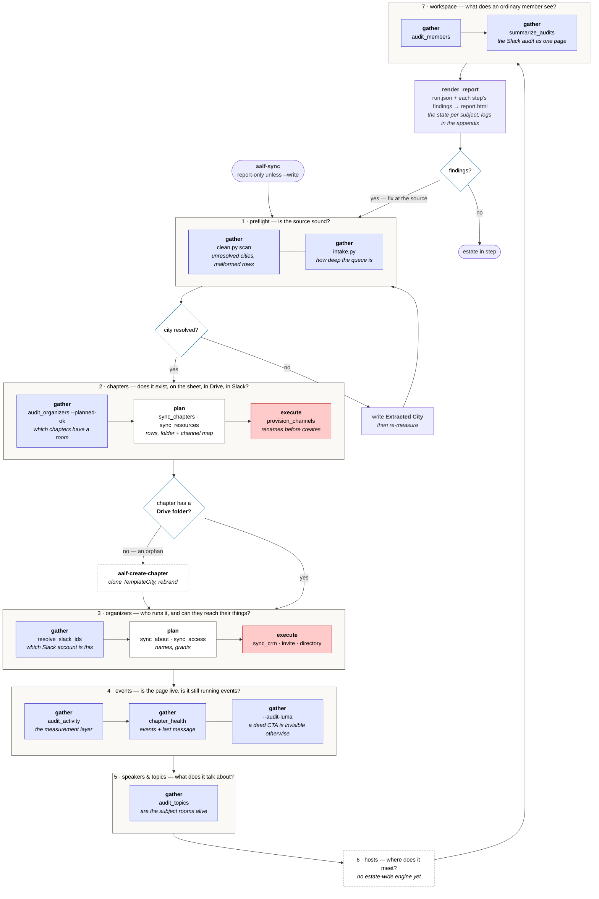
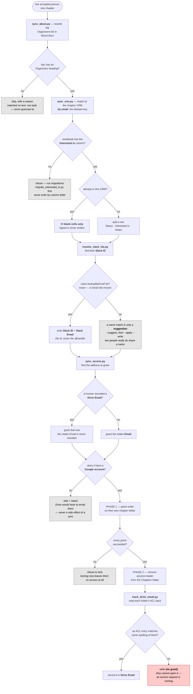

# AAIF Community Events Toolkit

Agent Skills for running **AAIF (Agentic AI Foundation)** in‑person and online
events — from writing the LinkedIn announcement to spinning up a brand‑new city
chapter or online event series.

Packaged as a **Claude Code plugin** (and a one‑plugin marketplace) so any
organizer can install the whole toolkit in two commands. The skills are plain
[Agent Skills](https://code.claude.com/docs/en/skills) (`SKILL.md` files), so they
also work in claude.ai and the Claude Agent SDK — see [Using in other tools](#using-in-other-tools).

---

## Install (Claude Code)

```bash
/plugin marketplace add aaif/community-events
/plugin install aaif-events@aaif
```

`marketplace add aaif/community-events` reads `.claude-plugin/marketplace.json` from this
repo; `@aaif` is the marketplace name. After installing, the skills auto‑activate
when you describe a matching task (e.g. “draft the announcement post for our July
event”), or invoke one explicitly with `/aaif-<skill>` (e.g.
`/aaif-announcement-post`).

### Quickstart (step‑by‑step)

Prefer the guided UI flow? Run these inside Claude Code:

1. **Add the marketplace** (the full git URL is equivalent to the `aaif/community-events`
   shorthand used in [Install](#install-claude-code) above):
   ```bash
   /plugin marketplace add https://github.com/aaif/community-events.git#main
   ```
2. **Enable it:** run `/plugin`, tab to **Marketplaces**, and enable the **aaif**
   marketplace.
3. **Turn on auto‑update** for the marketplace so you always get the latest skills.
4. **Install the plugin:** in that marketplace, browse plugins and install
   **aaif‑events**.
5. **Reload:**
   ```bash
   /reload-plugins
   ```
6. **Start using the skills:** type `/aaif-` to autocomplete the toolkit's
   commands (e.g. `/aaif-announcement-post`), or just describe your task and the
   matching skill auto‑activates.

   

---

## What's inside

The toolkit is **two separate halves**, and they are used at different times by
different people:

|  | ✍️ **Content skills** | 🛠️ **Ops skills** |
|---|---|---|
| Answer the question | "what do we *say* about this event?" | "is the estate actually in the state we think it is?" |
| Scope | **one event** | **the whole estate** — ~100 chapters |
| Run by | an organizer, per event | AAIF ops, on a cadence |
| Setup | **none** — paste the details, get copy | `gws` auth, and a Slack or Luma token for some |
| Writes to | nothing; they hand you text to edit and post | the Chapters List, chapter folders, CRMs, Drive ACLs, Slack |
| Safety model | the public-copy rule — never publish a detail that is not already public | report → approve → write, plus a gate on anything that touches a real person |
| Entry point | the individual skill | **`aaif-sync`**, the front door |

They meet in exactly one place: the per-chapter **`Event Tracker.docx`**, which
the ops side creates and the content side reads.

### ✍️ Content skills — no setup required
Pure writing skills. They take the event details you give them and produce copy.
Two of them (`aaif-carousel-copy`, `aaif-dayof-slides`) additionally *place* that
copy into a Drive template, and that step needs `gws` like any ops skill; the
writing itself does not.

They read the event's details from its tracker entry with one command, so nobody
has to paste them by hand:

```bash
python3 skills/aaif-event-status/scripts/fetch_tracker.py "<Chapter>" --event "<Event Title>"
```

Contact details (`SPEAKER EMAIL`, `DOOR CODE`, venue contact) are read but
deliberately **withheld** and only named — the surest way to keep an address out
of a published post is to keep it out of the agent's context in the first place.

| Skill | What it writes |
|---|---|
| `aaif-announcement-post` | LinkedIn launch post for when RSVPs open |
| `aaif-carousel-copy` | 6‑slide LinkedIn carousel announcing an event |
| `aaif-luma-description` | Luma event‑page description |
| `aaif-speaker-invite` | Warm speaker‑invite DM / email |
| `aaif-speaker-bio` | 60–80 word speaker bio + one‑liner |
| `aaif-dayof-slides` | Slide text for the “Day of Event” deck |
| `aaif-attendee-reminder` | Pre‑event reminder to people who RSVP'd |
| `aaif-recap-post` | Post‑event LinkedIn recap (within 48h) |

> **Attendee legal defaults.** The attendee‑facing skills (`aaif-announcement-post`,
> `aaif-luma-description`, `aaif-attendee-reminder`, `aaif-recap-post`) append two
> standing links by default — the [Code of Conduct](https://events.linuxfoundation.org/about/code-of-conduct/)
> and [Privacy Policy](https://www.linuxfoundation.org/legal/privacy-policy).
> Running your own chapter? Swap these URLs in each skill's `SKILL.md`; they sit
> in a banner that `scripts/check_tooling_banner.py` keeps byte-identical, so a
> copy you miss fails the build rather than shipping the old URLs.

### 🛠️ Ops skills — need Google Workspace access
These drive Google Drive / Sheets through the `gws` CLI (see below); a few also
talk to Slack or Luma.

#### The ops workflow

`aaif-sync` is the front door. One command runs the whole thing in dependency
order; `scripts/sync.py` is the single definition of that order, and
`nightly.py` wraps the same script for a scheduled run rather than keeping a
second copy of it.

```bash
python3 skills/aaif-sync/scripts/sync.py            # report everything, write nothing
python3 skills/aaif-sync/scripts/sync.py chapters   # one phase, or one step
python3 skills/aaif-sync/scripts/sync.py --write    # apply, after approval
```



Two branches are worth calling out, because they are where a run stops being a
straight line:

- **A chapter with no Drive folder is an orphan.** Its About doc and its CRM
  live *inside* that folder, so phase 4 has nowhere to write. The run reports
  it and **`aaif-create-chapter` has to go first** — clone TemplateCity,
  rebrand every asset, move the slide-5 map dot — and only then do organizers
  sync.
- **A near-miss city is never matched.** `Delhi` against an existing
  `Delhi NCR` row is reported for a human to confirm, never written: a
  near-miss has no override flag, so a wrong guess does not cost one
  confirmation, it blocks that city permanently.
- **Organizers are done before anyone else.** They are the only people who get a
  name in an About doc and a grant on a chapter folder — `sync_access` reads its
  list from the *intake*, never the CRM. Speakers and hosts reach exactly one
  surface, the chapter CRM, and follow in phase 5. That phase is **one pass and
  is not split by role**: `merge_people` combines a person's rows across role
  tabs into a single row reading `Organizer/Speaker`, and a role-scoped pass
  could only ever write the narrower half.

#### Inside phase 4 — what happens to one person

This is where most of the branching lives, and where the identity questions get
answered: *which Slack account is this*, and *which Google address can actually
be granted*.



The three findings this produces are the ones an operator acts on:
**`(no grant)`** in `Drive Email` means no permission on their chapter folder
matches any spelling of their address — they cannot open it, and an access
request is coming. A **name-match suggestion** means an email lookup missed and
a human has to confirm the account before it is written, because two people
genuinely do share a name. And a **skipped grant** means the address has no
Google account behind it; the fix that emails nobody is to record a
Google-backed address in `Drive Email` and re-run.

Reading the colours — they are the **gates**, and they are why this is not a
batch job:

| | Phase | Gate | Why |
|---|---|---|---|
| 🟦 | every `gather` step | **read-only** | no write mode exists at all; a finding is fixed at its source |
| 🟨 | `triage` | **human** | the runner **summarises, and never decides**. It reports how deep the queue is — "nothing to do" and "nobody has looked" are different facts — and exits `2` while rows wait. Accepting an applicant is a judgement about a person; you make it with `aaif-triage-intake`. |
| ⬜ | `chapters`, `resources`, `about`, `crm` | **open** | `--write` passes through after you approve the report |
| 🟧 | `access` | **report-only** | never receives `--write` from the runner — see † |
| 🟥 | `provision`, `invite`, `directory` | **approval** | creates rooms, adds and notifies real people — needs `--i-have-approval`; an unattended run only reports them |

† `access` is **report-only**: its grants hand standing
Drive access to addresses typed into a public form, and Drive may email the
person as a side effect, so the runner never passes it `--write` at all. It
reports, and a human runs the grant by hand.

**The order is not negotiable.** An unresolved city is invisible to every step
below it. A net-new city needs its feed row before anything can hang off it. The
CRM decides who gets Drive access, so it lands before access does. And the
resource map records what exists only once it exists. Selecting a subset cannot
reorder it — `sync.py access crm` still runs `crm` first, and a test pins that.

| Skill | What it does | Touches |
|---|---|---|
| `aaif-create-chapter` | Clone the **TemplateCity** folder and rebrand every asset for a new city | Google Drive |
| `aaif-create-online-series` | Clone the **TemplateSeries** folder under **Online/** and rebrand it for a new online series | Google Drive |
| `aaif-triage-intake` | Summarize who's awaiting review in the Community Intake sheet + draft outreach | Google Sheets |
| `aaif-clean-data` | Normalize/flag data quality in the Intake sheet (LinkedIn, casing, City=Other…) | Google Sheets |
| `aaif-backup` | Versioned local snapshots of critical data (Intake sheet by default, or any file) before risky edits | Google Drive |
| `aaif-create-event` | Add an event to a chapter/series Event Tracker (due-dates stamped from the event date), optionally creating the live Luma page on approval | Google Drive, Luma |
| `aaif-update-event` | Edit an event's details or move its date (recomputing all task due-dates), flag stale assets, optionally sync the change to Luma | Google Drive, Luma |
| `aaif-event-status` | Report overdue / due-soon event tasks by owner, plus read-only Luma registration stats | Google Drive, Luma |
| **`aaif-sync`** | **The ops front door.** Runs the whole estate sync in dependency order — preflight → chapters → organizers → events → speakers → hosts → workspace, each phase gather → plan → execute — report-first, with a gate on anything that touches a real person | everything below |
| `aaif-sync-chapters` | Phases `chapters` + `events`: intake cities and organizer names → rows on the public Chapters List; audits every row's Luma page | Google Sheets |
| `aaif-sync-organizers` | Phase `organizers`: accepted and pipeline people → each chapter's About doc, its private CRM, and its per-chapter Drive grants | Google Sheets/Drive/Docs |
| `aaif-sync-slack` | Phases `chapters` + `organizers`: the chapter → Drive-folder/Slack-channel resource map, then creating those rooms and inviting organizers into them | Slack, Google Sheets |
| `aaif-audit-slack` | Audit the community Slack workspace — chapter/organizer channel coverage and member/channel health — as a self-contained HTML report | Slack, Google Sheets |
| `aaif-community-pulse` | Draft the periodic "AAIF Community Organizer Update" Slack post from recent chapter events, community news, and the Luma calendar | Slack, Google Drive, Luma |
| `aaif-sync-badges` | Generate and sync chapter organizer badges (SVG + PNG) into the chapter-badges Drive folder | Google Drive |

> **Heads up — these ship with AAIF's own IDs.** The ops skills reference AAIF's
> Google resources (the Chapters Drive, the Intake Ops spreadsheet ID, Luma slug
> conventions). To run your own chapter, fork and edit the constants at the top of
> each skill's `scripts/*.py` and the IDs in its `SKILL.md`.

---

## Google Workspace access (for the ops skills)

The ops skills read and write Google Drive/Sheets through **one** route: the
**`gws` CLI**, driven from **Python**. There is no connector or MCP alternative —
every skill, script, and manual step goes through `gws`, so behaviour is the same
whether a human or an agent runs it.

> **`gws` is not an official Google tool.** It's a third‑party command‑line
> client for the Google Workspace APIs, not published or supported by Google, and
> not affiliated with AAIF or the Linux Foundation. You are granting it OAuth
> scopes over your own Workspace data — vet the source and pin a version you trust
> before pointing it at anything that matters.

> **Work in native Google formats wherever possible.** Prefer the Docs, Sheets,
> and Slides APIs against native `application/vnd.google-apps.*` files. Only fall
> back to byte-level OOXML surgery in Python (`.docx`/`.pptx`/`.xlsx` zip parts)
> when the file genuinely *is* a stored Office file — a `.docx` round-trip of a
> native Doc silently strips native features like Tabs. And never use LibreOffice
> /`soffice`, `unoconv`, or any desktop office suite, not even to render a local
> preview: it substitutes local system fonts for the brand fonts and drops OOXML it
> doesn't understand, so its output and its renders both misrepresent the real file.
> To see a file, render it through the API
> (`aaif_events.slides_export.render_slide_png` for a slide;
> `gws drive files copy` → `export` to PDF → trash the copy for a doc).

Install `gws` (a Google Workspace command‑line tool), then authenticate with one of:

- **Interactive OAuth:** `gws auth login`
- **Credentials file:** set `GOOGLE_WORKSPACE_CLI_CREDENTIALS_FILE=/path/to/oauth_credentials.json`
- **Pre‑obtained token:** set `GOOGLE_WORKSPACE_CLI_TOKEN` — in `.env`
  (gitignored) or via `read -s GOOGLE_WORKSPACE_CLI_TOKEN && export GOOGLE_WORKSPACE_CLI_TOKEN`,
  never as an inline `export TOKEN=...` (shell history keeps it) and never as a
  script argument (argv shows in `ps` and logs)
- **Client app:** set `GOOGLE_WORKSPACE_CLI_CLIENT_ID` and `GOOGLE_WORKSPACE_CLI_CLIENT_SECRET`, then `gws auth login`

On your Google Cloud project, enable the **Sheets**, **Docs**, **Slides**,
**Drive**, and **Forms** APIs.

**OAuth scopes.** Grant **read-write** scopes for anything you write to —
read-only access passes the verify step below but then fails on the first write
(form responses are read-only by nature, hence the `.readonly` scope). The
bundled scripts use the Sheets, Drive, and Slides scopes (the shared
`aaif_events.slides_export` helper renders deck previews through the Slides
API); the Docs and Forms scopes are for operating on those assets directly —
the chapter/series source docs and the intake form:

- `https://www.googleapis.com/auth/spreadsheets` — read/write the intake sheet *(scripts)*
- `https://www.googleapis.com/auth/drive` — copy, create, and update Drive files,
  incl. chapter/series asset clones *(scripts)*
- `https://www.googleapis.com/auth/documents` — read/edit chapter/series Docs
- `https://www.googleapis.com/auth/presentations` — read/edit day-of / series
  Slides, and render slide previews *(scripts)*
- `https://www.googleapis.com/auth/forms.body` — read/edit the intake form
- `https://www.googleapis.com/auth/forms.responses.readonly` — read form responses

Verify with:

```bash
gws sheets spreadsheets get --params '{"spreadsheetId":"<your-sheet-id>"}'
```

---

## Using in other tools

These skills are portable `SKILL.md` files, but not every tool consumes a Claude
Code *plugin*:

- **Claude Code** — install as the plugin above (native).
- **claude.ai / Claude Agent SDK** — zip a skill folder (the dir containing
  `SKILL.md`) and upload it as a Skill. **Caveat:** skills whose scripts import
  the shared `lib/aaif_events` package do **not** work zipped standalone; they
  need the full checkout (or plugin install), since the zip won't contain
  `lib/`. Those are `aaif-audit-slack`, `aaif-community-pulse`,
  `aaif-create-chapter`, `aaif-create-event`, `aaif-create-online-series`,
  `aaif-event-status`, `aaif-sync`, `aaif-sync-badges`, `aaif-sync-chapters`,
  `aaif-sync-organizers`, `aaif-sync-slack` and `aaif-update-event`.
  `aaif-create-online-series` is the newest arrival and the clearest case of
  the trade: it kept a private copy of the `gws` plumbing precisely to stay
  zippable, and the copy fell two fixes behind — one of them a scrub that kept
  an OAuth token out of a traceback. A copy nobody can keep in step is worse
  than the coupling it avoids.
  `scripts/check_portable_skills.py` keeps this list honest — adding a
  `lib/aaif_events` import to a skill that is not listed here fails the build,
  so giving up a skill's portability stays a decision someone makes on purpose.
  **A second, narrower coupling the guard does not model:** a few scripts
  import a *sibling skill's* module rather than `lib` —
  the four sync skills read each other's engines — `aaif-sync-slack`'s scripts
  import `sync_chapters` (chapters) and `sync_crm` (organizers),
  `aaif-audit-slack` imports `resolve_slack_ids` (organizers),
  `aaif-sync-slack/scripts/invite_organizers.py` imports `audit_organizers`
  from `aaif-audit-slack`, and `aaif-create-chapter/scripts/create_chapter.py`
  imports `sync_chapters` for the one definition of `CHAPTER_CAP`. All are
  already on the list above, so CI stays green — but for the `lib` reason, not
  this one. Those skills additionally need the sibling skill's folder present,
  not just `lib/`.

  The front-door skill is deliberately absent from that list: it runs every
  engine as a **subprocess**, importing none of them, which is what lets one
  runner drive four skills without taking on any of their coupling.

  **A third, softer one:** the eight content skills (`aaif-announcement-post`,
  `aaif-attendee-reminder`, `aaif-carousel-copy`, `aaif-dayof-slides`,
  `aaif-luma-description`, `aaif-recap-post`, `aaif-speaker-bio`,
  `aaif-speaker-invite`) *name* `aaif-event-status`' `fetch_tracker.py` as the
  way to read an event's tracker entry. They import nothing, so they still zip
  and still work — the agent falls back to asking the user for the details,
  which is what it did before the script existed. The command is a shortcut a
  full checkout has and a zip does not, not a dependency.
- **Cursor** — Cursor uses its own `.cursor/rules/*.mdc` format and does **not**
  consume Claude Code plugins. You can copy a `SKILL.md`'s instructions into a
  Cursor rule, but it won't run the bundled scripts the same way.

The portable unit is the `SKILL.md`; the *plugin/marketplace* packaging is
Claude‑Code‑specific.

---

## Repo layout

The repo root is **both** the marketplace and the single plugin — the marketplace
entry's `source` is `"./"`, so there's no extra `plugins/<name>/` nesting.

```
meetups/
├── .claude-plugin/
│   ├── marketplace.json          # one-plugin marketplace ("aaif")
│   └── plugin.json               # plugin manifest (aaif-events)
├── lib/
│   └── aaif_events/              # shared stdlib-only modules + their tests
├── scripts/                      # repo tooling (e.g. the banner-drift check)
├── skills/
│   ├── aaif-announcement-post/SKILL.md
│   ├── aaif-create-chapter/{SKILL.md, scripts/}
│   ├── aaif-sync/{SKILL.md, scripts/}          # the ops front door
│   ├── aaif-sync-chapters/{SKILL.md, scripts/, references/}
│   ├── aaif-sync-organizers/{SKILL.md, scripts/, migrations/, references/}
│   ├── aaif-sync-slack/{SKILL.md, scripts/, references/}
│   └── …  (23 skills total)
└── README.md
```

Bundled scripts are referenced from `SKILL.md` via `${CLAUDE_SKILL_DIR}/scripts/…`
so they resolve correctly once installed.

---

## Running skills from GitHub Actions

This repository is public, so a workflow log is a public document. Two workflows:

- **`validate.yml`** — lint + synthetic tests on every PR. Holds no credential.
- **`run-skill.yml.disabled`** — parked until the credentials exist (GitHub ignores
  the `.disabled` suffix; rename it back as the last step below). The only
  workflow with secrets. `workflow_dispatch` only;
  picks an engine (nightly sync, the three Slack audits); `write` is a checkbox
  and `access` grants still stay report-only. Output never leaves the runner.

Before the first dispatch, an admin configures the repo once (Settings →):

1. **Environments → `ops`**: add *Required reviewers* (≥1 other maintainer) and
   *Deployment branches → Selected → `main`*. Put the secrets **here**, not at
   repo level: `AAIF_SLACK_READ_TOKEN` (read scopes only), `AAIF_SLACK_WRITE_TOKEN`,
   `GOOGLE_WORKSPACE_CLI_TOKEN` (an access token for a dedicated service identity
   that has only the Drive/Sheets access the engines need — note `gws` access
   tokens expire in about an hour, so refresh the secret before each dispatch).
2. **Actions → General**: *Fork pull request workflows → Require approval for
   all outside collaborators*; *Workflow permissions → Read repository contents*
   (and untick "Allow GitHub Actions to create and approve pull requests").
3. **Branches → `main`**: require a PR, ≥1 review, and the `validate` checks.
   Without this, anyone with push can edit `run-skill.yml` and the environment
   rule is the only thing left.
4. Delete repo-level secrets that no workflow references.
5. Rename `run-skill.yml.disabled` → `run-skill.yml` and merge that. Until then
   nothing can be dispatched.

`scripts/check_workflows.py` enforces the workflow side of this in CI; the
settings side is yours to keep.

## Contributing

Issues and PRs welcome — new chapter‑ops skills, content variants, and
genericizing the AAIF‑specific IDs into config are all fair game. Keep each skill's
`description` action‑oriented (“Use when asked to …”) so it auto‑activates well.

## License

[MIT](LICENSE) © AAIF
